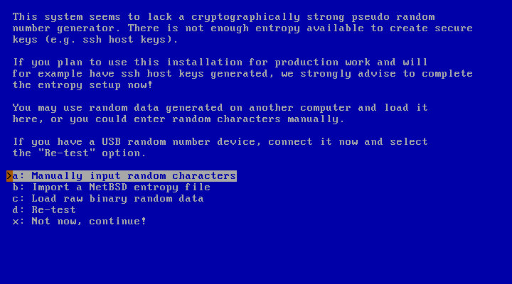
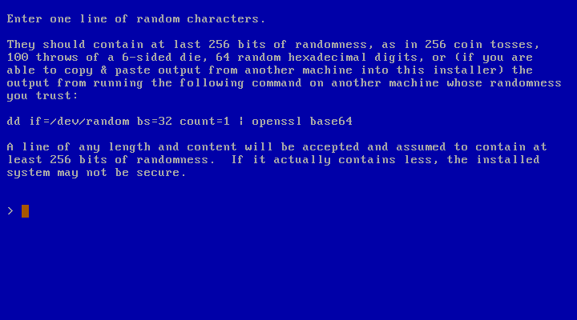

# NetBSD SysInst Entropy Fill Device

> [!CAUTION]
> **USE AT YOUR OWN RISK:** This Arduino sketch is experimental and has only seen limited testing

> [!IMPORTANT]
> **INDEPENDENT**: The NetBSD Foundation or developers do not endorse this project

## Requirements
* An Arduino Leonardo (ATmega32U4) compatible device (like the LilyGO F308)

## Disadvantages
* No tamper proofing whatsoever (Arduino bootloader present)
* No device self verification implemented
* Limited entropy health tests implemented
  - NIST SP 800-90B (4.4.1) Repetition Count Test
  - NIST SP 800-90B (4.4.2) Adaptive Proportion Test (without sliding window)
* Generates raw entropy of limited quality (mitigated through quantity and compression)

## Advantages
* Code is very easily understood
* Cheap and readily available hardware
* The entropy input can be visually inspected while being input

## Theory of operation

1. The device reads an analog value from an unconnected floating pin
2. All bits except for the Least Significant Bit are discarded
3. Two Least Significant Bits are collected to be debiased
   - The two bits are discarded if they're the same
   - The two bits are different, the first is passed as raw entropy
3. Six debiased bits are shifted into a near byte of raw entropy
4. The six bits of raw debiased entropy are encoded into a modified Base64
5. The encoded raw entropy is entered through a virtual keyboard function
6. NetBSD SysInst compresses (see [src/usr.sbin/sysinst/util.c#entropy_add_manual](https://github.com/NetBSD/src/blob/netbsd-10/usr.sbin/sysinst/util.c#L1154))
   the raw entropy through SHA256
7. NetBSD SysInst injects the compressed entropy into the kernel entropy pool

## Technical notes

The Base64 encoding is modified to prevent the virtual keyboard from accidentally
causing unwanted behavior for sysinst or the bourne shell if the device
is inserted untimely.

The device generates 1536 bits of debiased raw entropy, exceeding the required 256 bits
by a factor of 6 while NIST SP 800-90C (4.2) recommends a factor 2, with some caveats.

## How to use

If the system you're installing NetBSD onto does not have an entropy source
that NetBSD readily supports, you may encounter the following screen:

At this point plugin the NetBSD SysInst Entropy Fill Device, which will
automatically proceed to this screen, and start entering the collected
raw entropy through the virtual keyboard function:

When the device is finished it should exit the screen automatically.
